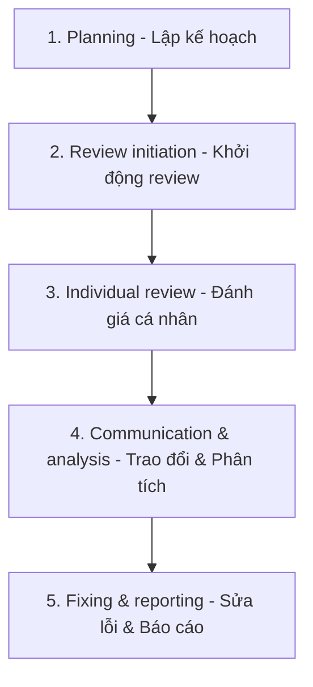

# Tóm tắt Chương 3: Kiểm thử tĩnh (Static Testing)
## Tài liệu: ISTQB Certified Tester Foundation Level (CTFL) Syllabus v4.0.1

Chương này trình bày các khái niệm cơ bản về kiểm thử tĩnh (không thực thi mã nguồn) và quy trình review sản phẩm bàn giao – một trong những hoạt động kiểm thử hiệu quả và tiết kiệm chi phí nhất trong chu kỳ phát triển phần mềm.

---

## 🔑 Từ khóa cốt lõi (Keywords)
* **Anomaly (Bất thường):** Bất kỳ điều kiện nào đi lệch khỏi mong đợi dựa trên đặc tả yêu cầu, tài liệu thiết kế, tiêu chuẩn, hoặc kinh nghiệm của người dùng.
* **Dynamic Testing (Kiểm thử động):** Kiểm thử liên quan đến việc thực thi mã nguồn của một thành phần hoặc hệ thống.
* **Static Testing (Kiểm thử tĩnh):** Kiểm thử một sản phẩm công việc mà không thực thi mã nguồn (bao gồm reviews và static analysis).
* **Static Analysis (Phân tích tĩnh):** Phân tích các sản phẩm công việc (chủ yếu là mã nguồn) bằng công cụ tự động để tìm lỗi mà không cần chạy code.
* **Review (Đánh giá):** Đánh giá thủ công một sản phẩm công việc để tìm lỗi hoặc cải tiến chất lượng.
* **Walkthrough (Duyệt qua sản phẩm):** Cuộc họp review do tác giả dẫn dắt để giải thích sản phẩm và thu thập ý kiến.
* **Technical Review (Review kỹ thuật):** Cuộc họp của các chuyên gia kỹ thuật nhằm giải quyết vấn đề kỹ thuật và đạt sự đồng thuận.
* **Inspection (Thanh tra):** Loại hình review trang trọng (formal) nhất nhằm tìm kiếm tối đa các bất thường bằng quy trình nghiêm ngặt.

---

## 🎯 Mục tiêu học tập (Learning Objectives - LOs)
* **FL-3.1.1 (K1):** Nhận biết các loại sản phẩm công việc có thể kiểm thử tĩnh.
* **FL-3.1.2 (K2):** Giải thích giá trị của kiểm thử tĩnh.
* **FL-3.1.3 (K2):** So sánh và đối chiếu kiểm thử tĩnh và kiểm thử động.
* **FL-3.2.1 (K1):** Xác định lợi ích của việc nhận phản hồi sớm và thường xuyên từ stakeholder.
* **FL-3.2.2 (K2):** Tóm tắt các hoạt động của quy trình review.
* **FL-3.2.3 (K1):** Nhớ lại trách nhiệm của các vai trò chính khi thực hiện review.
* **FL-3.2.4 (K2):** So sánh và đối chiếu các loại review khác nhau.
* **FL-3.2.5 (K1):** Nhớ lại các yếu tố đóng góp vào một buổi review thành công.

---

## 1. Cơ bản về Kiểm thử tĩnh (Static Testing Basics)

### 📌 Kiểm thử tĩnh là gì?
Kiểm thử tĩnh là quá trình đánh giá các sản phẩm công việc (work products) **mà không thực thi mã nguồn**. Quá trình này được thực hiện thông qua:
* **Kiểm tra thủ công (Reviews):** Đọc, đánh giá tài liệu bằng con người.
* **Phân tích tự động (Static Analysis):** Sử dụng các công cụ để kiểm tra mã nguồn hoặc mô hình thiết kế dựa trên các luật định sẵn.

> [!NOTE]
> Kiểm thử tĩnh có thể áp dụng cho cả hoạt động **Verification** (xác nhận sản phẩm được xây dựng đúng thiết kế) và **Validation** (xác nhận sản phẩm đáp ứng đúng nhu cầu người dùng).

Trong các mô hình Agile, kiểm thử tĩnh diễn ra liên tục thông qua sự phối hợp giữa Tester, Product Owner (PO), Business Analyst (BA) và Developer trong các buổi:
* *Example mapping*
* *Collaborative user story writing*
* *Backlog refinement*
Đảm bảo các User Story đạt tiêu chuẩn **Definition of Ready (DoR)** trước khi đưa vào phát triển.

### 📁 Các sản phẩm công việc có thể kiểm thử tĩnh
Hầu như bất kỳ sản phẩm nào có thể đọc và hiểu được đều có thể thực hiện kiểm thử tĩnh:
* Tài liệu đặc tả yêu cầu (Requirement specifications), User Stories, Tiêu chí nghiệm thu (Acceptance Criteria).
* Tài liệu thiết kế kiến trúc, thiết kế hệ thống, cơ sở dữ liệu.
* Mã nguồn (Source code) - áp dụng phân tích tĩnh (Static Analysis).
* Testware: Test plan, test cases, test scripts, test charters.
* Tài liệu dự án: Hợp đồng, kế hoạch dự án, tài liệu hướng dẫn sử dụng.

> [!WARNING]
> Những sản phẩm khó diễn giải bằng con người hoặc không có cấu trúc cú pháp rõ ràng cho công cụ quét (ví dụ: mã nguồn đóng của bên thứ ba do ràng buộc pháp lý) sẽ không phù hợp để thực hiện kiểm thử tĩnh.

### 💎 Giá trị của Kiểm thử tĩnh
* **Phát hiện lỗi sớm:** Tìm ra lỗi ngay từ giai đoạn thu thập yêu cầu và thiết kế (Nguyên lý kiểm thử sớm), giúp giảm thiểu chi phí sửa lỗi ở các giai đoạn sau.
* **Tìm ra các lỗi mà kiểm thử động khó phát hiện:** Ví dụ như đoạn code không bao giờ chạy tới (unreachable code), thiết kế cơ sở dữ liệu kém tối ưu, biến chưa khai báo, hoặc sự không nhất quán trong tài liệu yêu cầu.
* **Tạo sự hiểu biết chung (Shared Understanding):** Giúp cải tiến giao tiếp và chia sẻ kiến thức giữa các thành viên dự án (Developers, Testers, Business Representatives).
* **Đảm bảo yêu cầu đúng đắn:** Đánh giá xem yêu cầu có phản ánh đúng nhu cầu thực tế của stakeholder hay không.

---

### 📊 So sánh Kiểm thử tĩnh và Kiểm thử động (Static vs Dynamic Testing)

| Đặc tính | Kiểm thử tĩnh (Static Testing) | Kiểm thử động (Dynamic Testing) |
| :--- | :--- | :--- |
| **Thực thi mã nguồn** | ❌ Không thực thi code. | ✔ Bắt buộc thực thi code. |
| **Đối tượng áp dụng** | Áp dụng được cho cả sản phẩm chạy được (executable) và không chạy được (non-executable) như tài liệu. | Chỉ áp dụng cho sản phẩm chạy được (executable code/software). |
| **Cách thức phát hiện** | Phát hiện **trực tiếp lỗi (defects)** nằm trong sản phẩm công việc. | Gây ra **sự cố (failures)** khi chạy, từ đó phân tích ngược lại để tìm ra lỗi (defects). |
| **Đo lường chất lượng** | Đo lường các thuộc tính không phụ thuộc thực thi (ví dụ: tính dễ bảo trì - maintainability, độ phức tạp code). | Đo lường các thuộc tính xuất hiện khi vận hành (ví dụ: hiệu năng - performance, độ tin cậy - reliability). |
| **Độ phủ kiểm thử** | Dễ dàng kiểm tra các nhánh code hiếm khi được thực thi hoặc các đường dẫn khó đạt tới. | Khó bao phủ toàn bộ các đường dẫn/nhánh code nếu không thiết kế test case rất phức tạp. |

#### 🐛 Các lỗi điển hình dễ phát hiện bằng Kiểm thử tĩnh:
1. **Lỗi yêu cầu:** Sự mâu thuẫn, mơ hồ, thiếu sót, trùng lặp hoặc không chính xác trong đặc tả.
2. **Lỗi thiết kế:** Cấu trúc cơ sở dữ liệu kém hiệu quả, phân rã module không hợp lý.
3. **Lỗi lập trình:** Biến chưa được gán giá trị, biến chưa khai báo, code trùng lặp, code quá phức tạp.
4. **Lệch chuẩn:** Không tuân thủ tiêu chuẩn lập trình (coding standards) hoặc quy ước đặt tên (naming conventions).
5. **Sai sót interface:** Sự không khớp về số lượng, kiểu dữ liệu hoặc thứ tự của các tham số đầu vào.
6. **Lỗ hổng bảo mật:** Các lỗi bảo mật phổ biến như tràn bộ đệm (buffer overflow).
7. **Thiếu sót độ bao phủ:** Thiếu kịch bản kiểm thử cho một tiêu chí nghiệm thu cụ thể.

---

## 2. Quá trình phản hồi và đánh giá (Feedback and Review Process)

### 📢 Lợi ích của phản hồi sớm từ Stakeholder
* Giúp sớm phát hiện sự sai lệch giữa sản phẩm đang phát triển và mong đợi của khách hàng.
* Tránh việc lãng phí nguồn lực để làm lại (costly rework), trễ hạn tiến độ, hoặc thất bại hoàn toàn của dự án.
* Giúp đội phát triển tập trung vào những tính năng mang lại giá trị cao nhất và giảm bớt các rủi ro đã được nhận diện.

---

### 🔄 Các hoạt động trong Quy trình Review (theo tiêu chuẩn ISO/IEC 20246)

Quy trình review tiêu chuẩn gồm **5 bước** liên tục như sau:

1. **Planning (Lập kế hoạch):**
   * Xác định phạm vi review (mục đích, sản phẩm cần đánh giá, tiêu chí chất lượng).
   * Lựa chọn nhân sự tham gia, xác định vai trò.
   * Định nghĩa tiêu chí hoàn thành (exit criteria).
   * Ước lượng công sức và thiết lập khung thời gian.
2. **Review initiation (Khởi động review):**
   * Đảm bảo mọi thành viên sẵn sàng tham gia và có quyền truy cập sản phẩm.
   * Phân phát sản phẩm và tài liệu bổ trợ (checklist, tiêu chuẩn).
   * Giải thích rõ vai trò, trách nhiệm và mục tiêu cho từng reviewer.
3. **Individual review (Đánh giá cá nhân):**
   * Mỗi reviewer tự đọc tài liệu/sản phẩm một cách độc lập.
   * Áp dụng các kỹ thuật review (như checklist-based, scenario-based) để phát hiện các bất thường (anomalies).
   * Ghi lại toàn bộ anomalies, câu hỏi (questions), và khuyến nghị (recommendations).
4. **Communication and analysis (Trao đổi và phân tích):**
   * Tổ chức họp thảo luận (review meeting) để phân tích các anomalies đã phát hiện.
   * Xác định xem anomaly nào là lỗi thực sự (defect), gán quyền sở hữu lỗi và hành động khắc phục.
   * Đánh giá mức độ chất lượng của sản phẩm để đưa ra quyết định nghiệm thu.
5. **Fixing and reporting (Sửa lỗi và báo cáo):**
   * Tạo defect report cho các lỗi cần sửa.
   * Tác giả (Author) thực hiện sửa lỗi.
   * Kiểm tra lại lỗi đã sửa, đối chiếu tiêu chí hoàn thành (exit criteria) để nghiệm thu sản phẩm.
   * Báo cáo kết quả review cho các bên liên quan.

---

### 👥 Vai trò và Trách nhiệm trong Quy trình Review

| Vai trò | Trách nhiệm chính |
| :--- | :--- |
| **Manager (Người quản lý)** | Quyết định sản phẩm nào cần được review, cung cấp và phân bổ nguồn lực (nhân sự, ngân sách, thời gian). |
| **Review leader (Trưởng nhóm review)** | Chịu trách nhiệm tổng thể cuộc review; quyết định người tham gia, phân công công việc, thiết lập địa điểm và thời gian. |
| **Author (Tác giả)** | Người tạo ra sản phẩm được review. Có trách nhiệm giải thích sản phẩm và sửa chữa các lỗi được phát hiện sau review. |
| **Moderator (Người điều phối / Facilitator)** | Đảm bảo cuộc họp review diễn ra suôn sẻ, quản lý thời gian, hòa giải xung đột và tạo môi trường thảo luận an toàn, cởi mở. |
| **Scribe (Thư ký / Recorder)** | Ghi chép lại toàn bộ các bất thường mới phát sinh trong cuộc họp, ghi nhận các quyết định và hành động cần thực hiện. |
| **Reviewer (Người đánh giá)** | Chuyên gia kỹ thuật, tester, hoặc bên liên quan tự thực hiện đánh giá cá nhân và đưa ra ý kiến nhận xét về sản phẩm. |

---

### 🛠 Các loại hình Review phổ biến (Review Types)
Mức độ trang trọng (formality) của buổi review phụ thuộc vào quy trình phát triển (SDLC), tính chất phức tạp của sản phẩm, yêu cầu pháp lý và nhu cầu lưu vết lịch sử (audit trail).

#### 1. Informal review (Review không chính thức)
* **Đặc điểm:** Không tuân thủ quy trình định sẵn, không yêu cầu ghi chép tài liệu đầu ra chính thức.
* **Mục tiêu:** Phát hiện các bất thường một cách nhanh chóng và ít tốn kém nhất. Thường là việc hai người ngồi kiểm tra chéo cho nhau (buddy check, pair review).

#### 2. Walkthrough (Duyệt qua sản phẩm)
* **Đặc điểm:** Do chính **Tác giả (Author)** dẫn dắt cuộc họp. Reviewer có thể chuẩn bị trước hoặc không bắt buộc.
* **Mục tiêu:** Giải thích sản phẩm, thu thập phản hồi, đào tạo người tham gia, đạt được sự đồng thuận và phát hiện lỗi.

#### 3. Technical Review (Review kỹ thuật)
* **Đặc điểm:** Thực hiện bởi nhóm các chuyên gia kỹ thuật có năng lực, dẫn dắt bởi **Moderator**. Yêu cầu có đánh giá cá nhân trước cuộc họp.
* **Mục tiêu:** Giải quyết các vấn đề kỹ thuật, thảo luận giải pháp thay thế, đạt đồng thuận kỹ thuật và phát hiện lỗi.

#### 4. Inspection (Thanh tra / Kiểm tra chi tiết)
* **Đặc điểm:** Loại hình review **trang trọng nhất (most formal)**. Tuân thủ nghiêm ngặt 5 bước quy trình, sử dụng checklist và thu thập các số liệu (metrics) để cải tiến quy trình.
* **Quy tắc đặc biệt:** **Tác giả (Author) KHÔNG được làm Review leader hoặc Scribe** để đảm bảo tính khách quan tối đa.
* **Mục tiêu:** Phát hiện tối đa số lượng bất thường và lỗi trong sản phẩm.

---

### 🏆 Các yếu tố quyết định sự thành công của Review (Success Factors)
Để hoạt động review đạt hiệu quả cao nhất, tổ chức cần chú trọng các yếu tố sau:
1. **Mục tiêu rõ ràng:** Đặt ra mục tiêu cụ thể và tiêu chí hoàn thành đo lường được. Tuyệt đối **không dùng review để đánh giá năng lực cá nhân** của tác giả sản phẩm.
2. **Chọn loại hình phù hợp:** Lựa chọn loại review dựa trên ngữ cảnh dự án, tính chất sản phẩm và rủi ro.
3. **Review theo phần nhỏ (Small Chunks):** Chia nhỏ tài liệu để review nhằm tránh việc reviewer bị mất tập trung do quá tải thông tin.
4. **Dành đủ thời gian chuẩn bị:** Đảm bảo reviewers có đủ thời gian thực hiện đánh giá cá nhân trước khi họp.
5. **Ủng hộ từ Quản lý (Management Support):** Ban quản lý cần coi trọng và dành thời gian hợp lý cho hoạt động review trong lịch trình dự án.
6. **Văn hóa xây dựng:** Cung cấp phản hồi mang tính đóng góp, tập trung vào sản phẩm (chỉ ra lỗi của sản phẩm, không chỉ trích con người).
7. **Đào tạo bài bản:** Đào tạo cho mọi người về quy trình, kỹ thuật review và kỹ năng giao tiếp trong họp review.
